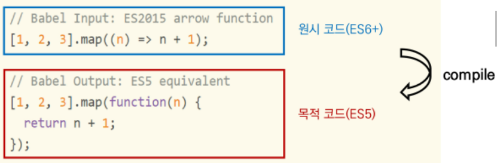
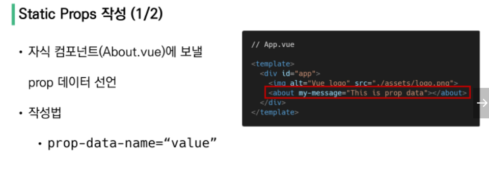
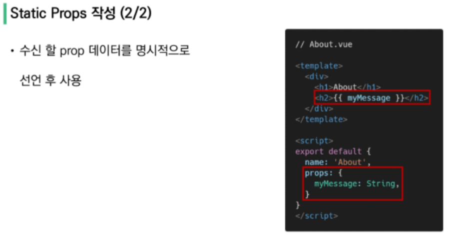

## SFC (Single File Component)

- 컴포넌트 

  기본 HTML 엘리먼트를 확장하여 **재사용** 가능한 코드를 캡슐화 하는데 도움을 줌

  (다시 사용할 수 있는 범용성을 위해 개발된 소프트웨어 구성 요소)

#### SFC

- Vue의 컴포넌트 기반 개발의 핵심 특징
- 하나의 컴포넌트는 .vue 확장자를 가진 하나의 파일 안에서 작성되는 코드의 결과물 (HTML, CSS, JavaScript)
- vue 컴포넌트 === vue 인스턴스(new Vue({})) (.vue 파일 안에 작성된 코드의 집합)

##### Vue Component 구조

- 한 화면 안에서도 기능 별로 각기 다른 컴포넌트가 존재 
  - 하나의 컴포넌트는 여러 개의 하위 컴포넌트를 가질 수 있음
- Vue 컴포넌트는 const app = new Vue({...})의 app을 의미하며 이는 Vue 인스턴스
  - 컴포넌트 기반의 개발이 **반드시 파일 단위로 구분되어야 하는 것이 아님**
  - 단일 .html 파일 안에서도 여러개의 컴포넌트를 만들어 개발 가능

## Vue CLI

Vue.js 개발을 위한 표준 도구, 프로젝트 구성을 도와주며 Vue 개발 생태계에서 표준 tool 기준을 목표로 함

확장 플러그인, GUI, Babel 등 다양한 tool 제공

#### Node.js

- 자바 스크립트가 브라우저가 아닌 환경에서도 구동할 수 있도록 하는 자바 스크립트 런타임 환경
- Chrome V8 엔진 제공하여 여러 OS환경에서 실행할 수 있는 환경 제공
- SSR 아키텍처에서도 사용할수 있도록 함
- 2009년 Ryan Dahl에 의해 발표

#### NPM (Node Package Manage)

- 자바 스크립트 언어를 위한 패키지 관리자 (Python - pip , Node.js - NPM )
- Node.js 설치 시 함께 설치됨

## Babel & Webpack

#### Babel

JavaScript compiler

자바 스크립트의 ECMAScript 2015+ 코드(원시 코드)를 이전 버전(목적 코드)으로 번역/변환해주는 도구

- 예시

#### Webpack

static module bundler

모듈 간 의존성 문제를 해결하기 위한 도구

프로젝트에 필요한 모든 모듈을 매핑하고 내부적으로 종속성 그래프를 빌드함

- module

  파일 하나를 의미

  ESM(ECMA Script Module), AMD(Asynchronous Module Definition), CommonJS, UMD(Universal Module Definition)

  - 모듈 의존성 문제

    모듈의 수가 많아지고 라이브러리 혹은 모듈간의 의존성이 깊어지면서 특정한 곳에서 발생한 문제가 어떤 모듈간의 문제인지 파악하기 어려움 

    ➡ 해결하기 위해 Webpack 등장

- bundler

  의존성 문제를 해결해주는 작업 = bundling, 도구 = bundler,  Webpack은 이 중 하나

  여러 모듈을 하나로 묶어주고 묶은 파일은 하나(혹은 여러개)로 합쳐짐

  bundling된 결과물은 더 이상 순서에 영향을 받지 않고 동작하게 됨

  snowpack, parcel, rollup.js 등의 webpack 이외에도 다양한 모듈 번들러 존재

  

#### Vue 프로젝트 구조

- node_modules :  node.js 환경의 여러 의존성 모듈

- public/index.html : Vue 앱의 뼈대가 되는 파일, 실제 제공되는 단일 html 파일

- src

  - assets : webpack에 의해 빌드된 정적 파일

  - components : 하위 컴포넌트들이 위치

  - App.vue : 최상위 컴포넌트

  - main.js : 

    webpack이 빌드 시작할 때 가장 먼저 불러오는 entry point

    실제 단일 파일에서 DOM과 data를 연결 했던 것과 동일한 작업이 이루어지는 곳

    Vue 전역에서 활용할 모듈을 등록할 수 있는 파일

- babel.config.js : babel 관련 설정이 작성된 파일

- package.json : 프로젝트의 종속성 목록과 지원되는 브라우저에 대한 구성 옵션이 포함

- package-lock.json 

  node_modules에 설치되는 모듈과 관련된 모든 의존성을 설정 및 관리

  팀원 및 배포 환경에서 정확히 동일한 종속성을 설치하도록 보장하는 표현

  사용할 패키지의 버전을 고정, 개발 과정간의 의존성 패키지 충돌 방지

  

## Pass Props & Emit Events

부모는 자식에게 데이터를 전달 (Pass **props**),

자식은 자식에게 일어난 일을 부모에게 알림(메시지) (Emit **event**)

##### 컴포넌트 구조

- 템플릿 (HTML)
  - body 부분, 각 컴포넌트 작성
- 스크립트 (JavaScript)
  - 컴포넌트 정보, 데이터, 메서드 등 vue 인스턴스를 구성하는 대부분이 작성됨
- 스타일 (CSS)
  - 컴포넌트의 스타일 담당

##### 컴포넌트 등록 3단계

- 불러오기 (import)
- 등록하기 (register)
- 보여주기 (print)

#### Props

- 부모 컴포넌트의 정보를 전달하기 위한 사용자 지정 특성
- 자식(하위) 컴포넌트는 props 옵션을 사용하여 수신하는 props를 명시적으로 선언해야 함
- 단반향 바인딩 형성
  - 부모 속성이 변경되면 자식 속성에게 전달되지만, 반대 방향으로는 안됨
    - 자식 요소가 의도치 않게 부모요소의 상태를 변경하여 앱의 데이터 흐름을 이해하기 어렵게 만드는 일을 방지
  - 부모 컴포넌트가 업데이트 될 때마다 자식 요소의 모든 prop들이 최신 값으로 업데이트

- 이름 컨벤션
  - 선언 : camelCase
  - HTML : kebab-case

- 컴포넌트의  'data'는 반드시 함수여야 함  
  - 각 인스턴스는 모든 같은 data 객체를 공유함으로 새로은 객체 data를 return 하여야 함 

#### Emit event

- $emit(eventName)

  현재 인스턴스에서 이벤트를 트리거

  추가인자는 리스너의 콜백함수로 전달

- 부모 컴포넌트는 자식 컴포넌트가 사용되는 템플릿에서 v-on을 사용하여 자식 컴포넌트가 보낸 이벤트를 청취

- 이벤트 이름은 항상 kebab-case 사용

## Vue Router

라우트(route)에 컴포넌트를 매핑한 후, 어떤 주소에서 렌더링할 지 알려줌

- index.js : 라우터에 관련된 정보 및 설정이 작성되는 곳
- router-link
  - 사용자 네비게이션을 가능하게 하는 컴포넌트 
  - 목표 경로는 'to' prop으로 지정됨
  - HTML5 히스토리 모드에서 router-link는 클릭 이벤트를 차단하여, 브라우저가 페이지를 다시 로드하지 않도록 함
  - a 태그지만 우리가 알고 있는 GET 요청을 보내는 a 태그와 조금 다르게, 기본 GET 요청을 보내는 이벤트를 제거한 형태로 구성됨
- router-view
  - 주어진 라우트에 대해 일치하는 컴포넌트를 렌더링하는 컴포넌트
  - 실제 컴포넌트가 DOM에 부착되어 보이는 자리를 의미
  - router-link를 클릭하면 해당 경로와 연결되어 있는 index.js에 정의한 컴포넌트가 위치

##### History mode

브라우저의 히스토리는 남기지만 실제 페이지는 이동하지 않는 기능을 지원 

즉, 페이지를 다시 로드하지 않고 URL을 탐색할 수 있음