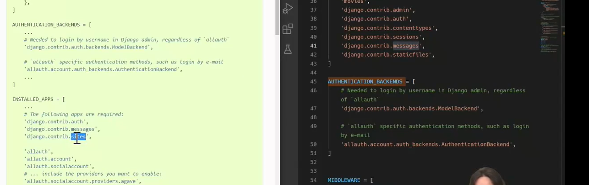
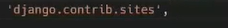
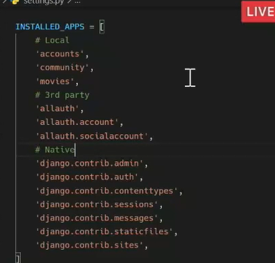
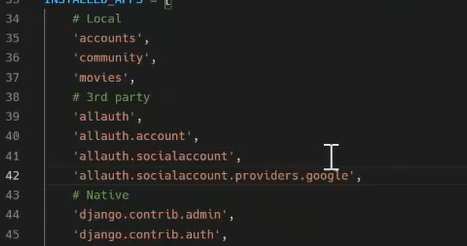
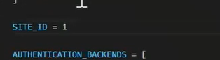
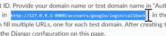
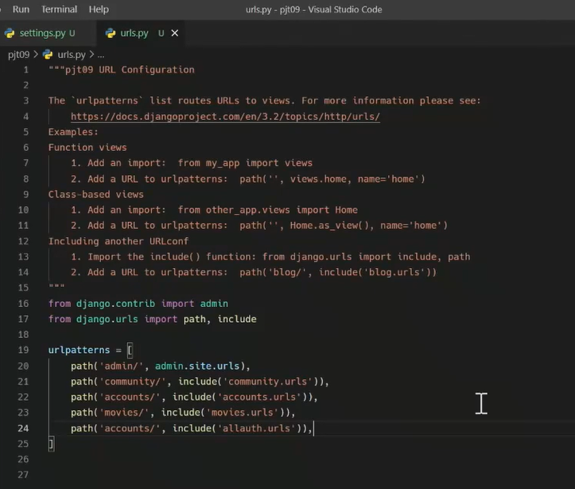
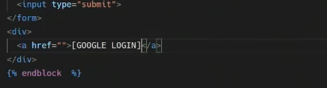
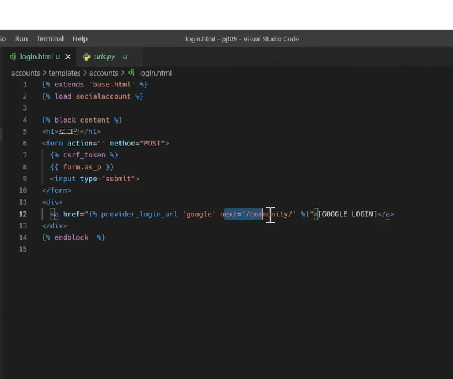
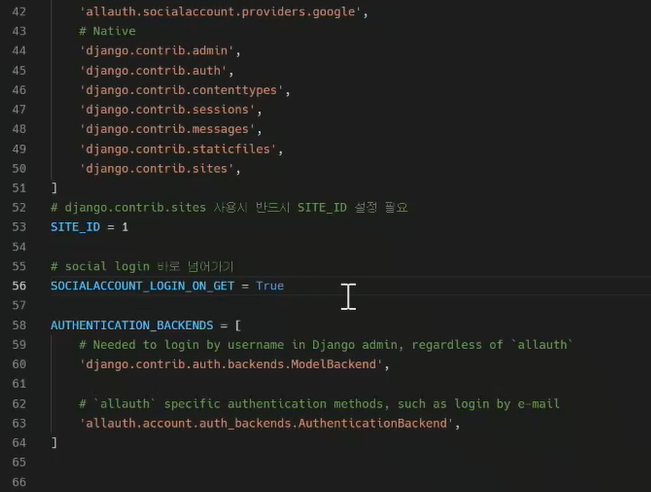

구글 클라우드 플랫폼

> api 및 서비스 , oauth 동의화면 (외부) >  범위추가 (민감x > 이메일) > 대시보드 > 사용자 인증정보 > 만들기 > oauth 클라우드 id 만들기 > 웹 > 승인된 리디렌션 > 
>
> admin > 소셜 어플리케이션 > 추가 > 클라이언트아이디 비번 넣ㄴ기
>
> http://127.0.0.1:8000/accounts/google/login/callback
>
> 

해시태그 >> 

해시 태그 누르면 > 관련 해시를 가진 영화 나오기!

